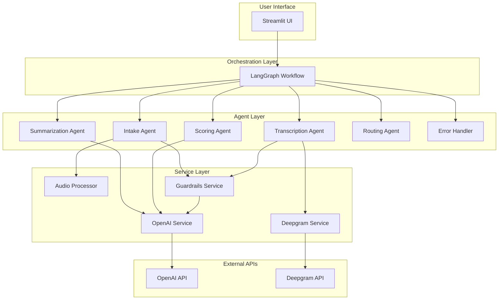
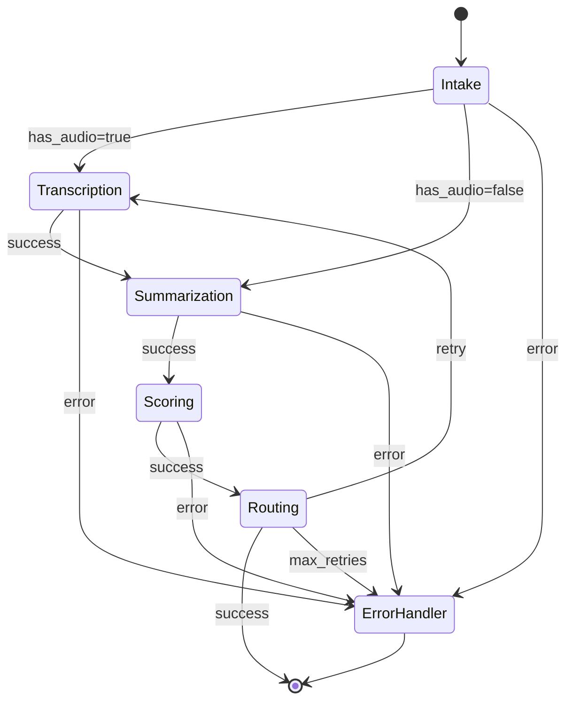
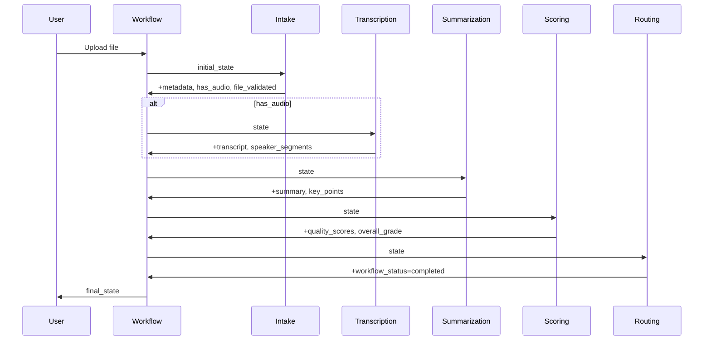
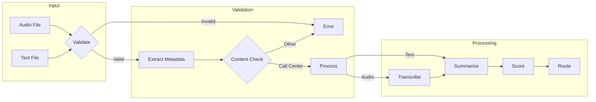
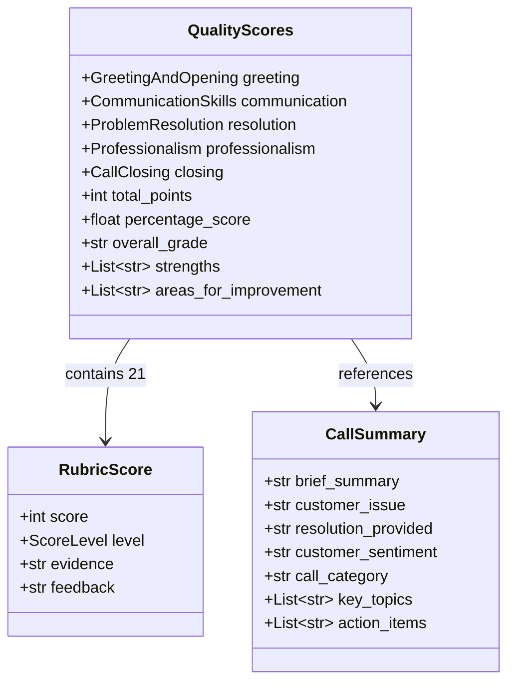
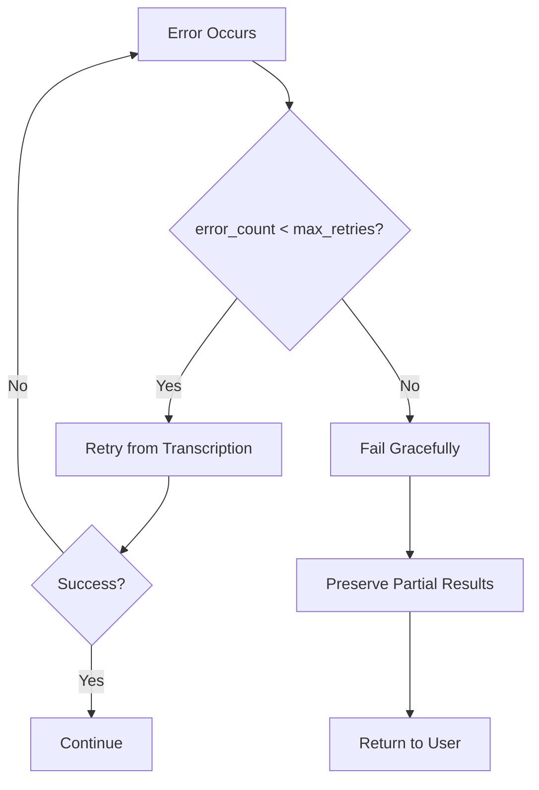

# Architecture Guide

This document provides a comprehensive overview of the Call Center Quality Grading System architecture, including design decisions, component interactions, and data flow.

## Table of Contents

- [System Overview](#system-overview)
- [High-Level Architecture](#high-level-architecture)
- [Agent Architecture](#agent-architecture)
- [State Management](#state-management)
- [Data Flow](#data-flow)
- [Error Handling](#error-handling)
- [External Services](#external-services)
- [Design Decisions](#design-decisions)

## System Overview

The Call Center Quality Grading System is built on a multi-agent architecture using LangGraph for workflow orchestration. The system processes call recordings or transcripts through a series of specialized agents, each responsible for a specific task in the quality assessment pipeline.

### Key Principles

1. **Separation of Concerns**: Each agent handles one specific task
2. **Fault Tolerance**: Automatic retry with graceful degradation
3. **Observability**: Real-time progress tracking and logging
4. **Type Safety**: Pydantic models for all data structures
5. **Extensibility**: Easy to add new agents or modify the workflow

## High-Level Architecture



## Agent Architecture

### Workflow Graph



### Agent Descriptions

#### Intake Agent (`agents/intake_agent.py`)

**Purpose**: Entry point that validates input files and extracts metadata.

**Responsibilities**:
- Validate file exists and is within size limits
- Determine file type (audio vs transcript)
- Extract metadata (duration, format, sample rate)
- Validate content is a call center conversation
- Initialize workflow state

**Input State**:
```python
{
    "input_file_path": str,  # Path to uploaded file
}
```

**Output State**:
```python
{
    "metadata": CallMetadata,
    "has_audio": bool,
    "file_validated": bool,
    "input_file_type": str,  # "audio" or "transcript"
    "transcript": Optional[str],  # Set if text file
    "current_step": "intake",
    "workflow_status": "in_progress",
}
```

#### Transcription Agent (`agents/transcription_agent.py`)

**Purpose**: Converts audio files to text with speaker identification.

**Responsibilities**:
- Call Deepgram API for speech-to-text
- Perform speaker diarization
- Use GPT to identify speaker roles (Agent vs Customer)
- Validate transcribed content
- Format transcript with speaker labels

**Input State**:
```python
{
    "input_file_path": str,
    "transcript": None,  # Not yet transcribed
}
```

**Output State**:
```python
{
    "transcript": str,  # Formatted with speaker labels
    "transcript_plain": str,  # Raw text
    "speaker_segments": List[dict],
    "num_speakers": int,
    "transcription_language": str,
    "transcription_duration": float,
}
```

#### Summarization Agent (`agents/summarization_agent.py`)

**Purpose**: Generates structured call summary using GPT-4o.

**Responsibilities**:
- Analyze transcript for key information
- Extract customer issue and resolution
- Determine customer sentiment
- Categorize call type
- Identify action items

**Input State**:
```python
{
    "transcript": str,
}
```

**Output State**:
```python
{
    "summary": CallSummary,
    "key_points": List[str],
    "customer_intent": str,
    "resolution_status": str,  # "resolved", "escalated", "pending"
}
```

#### Scoring Agent (`agents/scoring_agent.py`)

**Purpose**: Evaluates call quality against rubric criteria.

**Responsibilities**:
- Score 21 rubric items (1-5 scale)
- Provide evidence and feedback for each score
- Calculate total and percentage scores
- Determine letter grade
- Identify strengths and improvement areas

**Input State**:
```python
{
    "transcript": str,
    "summary": CallSummary,
}
```

**Output State**:
```python
{
    "quality_scores": QualityScores,
    "overall_grade": str,  # A, B, C, D, F
    "recommendations": List[str],
}
```

#### Routing Agent (`agents/routing_agent.py`)

**Purpose**: Controls workflow progression and handles retries.

**Responsibilities**:
- Check for successful completion
- Determine if retry is needed and possible
- Track error history
- Calculate processing time
- Route to appropriate next step

**Routing Logic**:
```python
if no_error and quality_scores:
    return "success"  # -> END
elif error and error_count < max_retries:
    return "retry"    # -> Transcription
else:
    return "fallback" # -> ErrorHandler
```

#### Error Handler (`agents/routing_agent.py`)

**Purpose**: Generates user-friendly error messages and preserves partial results.

**Responsibilities**:
- Convert technical errors to user-friendly messages
- Track which partial results are available
- Log final error state
- Return gracefully to user

## State Management

### State Schema

The workflow state is defined using TypedDict for type safety:

```python
class CallCenterState(TypedDict):
    # Input
    input_file_path: str
    input_file_name: str
    input_file_type: str

    # Metadata
    metadata: CallMetadata
    has_audio: bool
    file_validated: bool

    # Processing Results
    transcript: str
    transcript_plain: str
    speaker_segments: List[dict]
    summary: CallSummary
    quality_scores: QualityScores
    overall_grade: str
    recommendations: List[str]

    # Workflow Control
    current_step: str
    workflow_status: str
    error: Optional[str]
    error_type: Optional[str]
    error_count: int
    error_history: List[dict]
    max_retries: int

    # Timing
    started_at: datetime
    completed_at: datetime
    processing_time_seconds: float
```

### State Transitions



## Data Flow

### Input Processing Flow



### Output Data Structure



## Error Handling

### Error Types

| Error Type | Description | Recovery |
|------------|-------------|----------|
| `FileNotFoundError` | File doesn't exist | User re-upload |
| `FileTooLargeError` | File exceeds limit | Use smaller file |
| `UnsupportedFormatError` | Invalid file type | Use supported format |
| `ContentValidationError` | Not a call transcript | Upload valid content |
| `TranscriptionError` | Deepgram API failure | Automatic retry |
| `SummarizationError` | OpenAI API failure | Automatic retry |
| `ScoringError` | Scoring failed | Automatic retry |

### Retry Strategy



### Error Message Mapping

```python
ERROR_MESSAGES = {
    "FileNotFoundError": "The uploaded file could not be found. Please try uploading again.",
    "FileTooLargeError": "The file is too large. Please upload a file under 100MB.",
    "UnsupportedFormatError": "This file format is not supported. Please use WAV, MP3, or TXT files.",
    "TranscriptionError": "Could not transcribe the audio. Please ensure the audio is clear and try again.",
    "SummarizationError": "Could not generate summary. Please try again later.",
    "ScoringError": "Could not complete quality scoring. Please try again later.",
    "ContentValidationError": "<detailed validation reason>",
}
```

## External Services

### OpenAI Service

**Purpose**: Wrapper for OpenAI GPT API with retry logic.

**Methods**:
- `generate(prompt, system_prompt)` - Text completion
- `generate_structured(prompt, response_model, system_prompt)` - Structured output

**Retry Configuration**:
```python
@retry(
    stop=stop_after_attempt(3),
    wait=wait_exponential(multiplier=1, min=4, max=60),
    retry=retry_if_exception_type((RateLimitError, APITimeoutError)),
)
```

### Deepgram Service

**Purpose**: Audio transcription with speaker diarization.

**Features**:
- Automatic language detection
- Speaker diarization
- Punctuation and formatting
- Smart formatting for numbers/dates

### Guardrails Service

**Purpose**: Content validation using Guardrails AI.

**Validation Logic**:
1. Check for minimum content length
2. Look for call center indicators (Agent:, Customer:, etc.)
3. Use LLM for ambiguous content
4. Return validation result with reason

## Design Decisions

### Why LangGraph?

- **State Management**: Built-in state passing between nodes
- **Conditional Routing**: Easy to define complex branching logic
- **Error Recovery**: Natural retry loops and error handling
- **Observability**: Streaming support for real-time updates
- **Type Safety**: Works well with TypedDict state

### Why Deepgram over Whisper?

- **Speaker Diarization**: Built-in support for identifying speakers
- **Real-time Streaming**: Can process as audio plays
- **Language Detection**: Automatic language identification
- **Speed**: Faster processing for long files

### Why Structured Output?

- **Consistency**: Guaranteed response format
- **Type Safety**: Pydantic validation
- **Reliability**: No parsing errors
- **Documentation**: Self-documenting schemas

### Modular Agent Design

Each agent is:
- **Stateless**: No internal state between calls
- **Focused**: Single responsibility
- **Testable**: Easy to unit test in isolation
- **Replaceable**: Can swap implementations

## Performance Considerations

### Bottlenecks

1. **Transcription**: Deepgram API call (depends on audio length)
2. **LLM Calls**: GPT-4o for summarization and scoring
3. **Content Validation**: Optional LLM call for ambiguous content

### Optimization Strategies

1. **Skip Transcription**: Text files bypass transcription entirely
2. **Content Indicators**: Quick regex check before LLM validation
3. **Retry with Backoff**: Exponential backoff prevents API throttling
4. **Streaming**: Real-time progress updates for user feedback

## Security Considerations

### API Key Management

- Keys stored in `.env` file (not committed)
- Loaded via pydantic-settings
- Never logged or exposed in errors

### File Handling

- Size limits enforced (100MB default)
- Format validation before processing
- Temporary files cleaned up after use

### Content Validation

- Guardrails prevent processing of non-call content
- Validates before expensive API calls
- Protects against prompt injection
